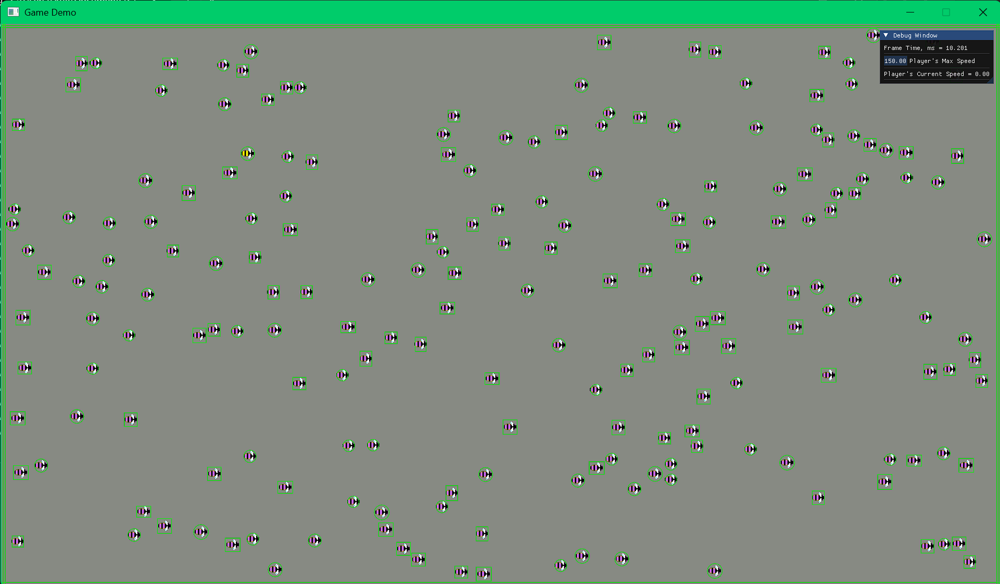

# Game Engine prototype with a game demo
## Features:
* Engine prototype with features described below
* Entity Component System with basic components—Transform, Rigidbody, Tag, Sprite, Box and Circle Colliders
* Controllable Timer—that can be started and asked for ellapsed time at any point—and ScopedTimer classes
* Update loop with deltaTime
* Input Manager class
* Image class for rendering image files through ImGUI and vulkan
* Optional rendering of debug visuals for entities
* Physics class for collision and raycast processing
* Data structures—quad tree, spatial hash grid—for physics and other algorithms
* Dynamic—movable, resizable, can be hidden by pressing tilde—Debug window with an ability to register new displayble fields
* And Game demo with a simple environment with random obstacles and a movable Player object—entity with a few components
* game window's title and size are set in the main() function located in main.cpp

### Example Games:
1. Flocking Bees - https://github.com/SergeiKulenkov/Flocking-Bees-The-Game

### Collisions demo

Demo with a controllable player entity, 4 walls and 200 dynamic obstacles with sprites. Frame time is asround 10ms (or 100 fps) in debug mode. Also showcases the QuadTree optimization for collision detection—without it the frame time is 4.5 times higher even when the tree is rebuilt every frame.

(the GIF format looks very slow, it's actually alright, video files can't be played here)

## Build system
Premake script files for the Engine static library and the Game main project.

Run Scripts/Setup.bat to install Premake and create project files and VS solution.

### Requirements - installed Vulkan SDK
### Used third party libraries - ImGUI, glm, glfw, Vulkan